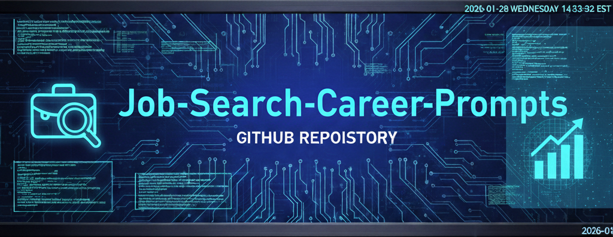
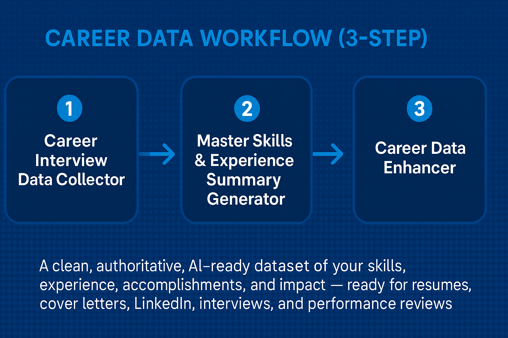
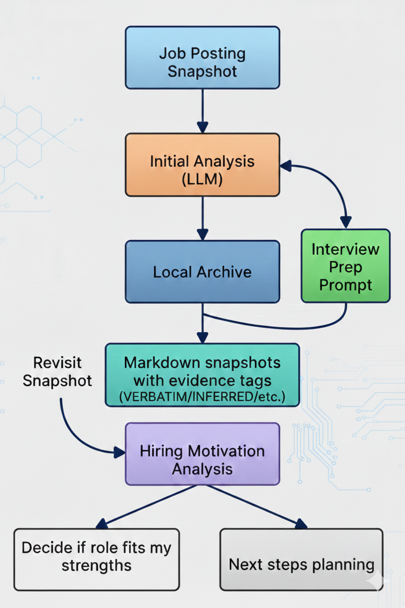

  

<h1 align="center">Job Search & Career Development Prompt Library</h1>
<h3 align="center">By Scott Malin — Cybersecurity & Automation Architect</h3>

A curated collection of AI‑powered prompts designed to accelerate job searches, strengthen professional branding, and support career transitions with clarity and confidence.

  
  
  
  

---

# ⭐ Featured Prompt

### **Master Skills & Experience Summary Generator.md** 
Transforms raw experience into a polished, recruiter‑ready skills and accomplishments summary tailored to any role or industry.

---

# 🚀 Career Data Workflow (High‑Value Prompt Sequence)

  

This repository includes a powerful three‑step workflow designed to help job seekers — and working professionals — **capture, structure, and enhance** their career accomplishments with precision.

This workflow solves a major problem:  
**AI hallucinations and inconsistent job‑search materials caused by scattered or incomplete personal data.**

## 1️⃣ Career Interview Data Collector  
Collects structured, high‑signal information about your experience, achievements, responsibilities, and impact.  
- Ideal after interviews, projects, or performance cycles  
- Produces raw but organized data  
- Creates a repeatable habit for capturing accomplishments  

## 2️⃣ Master Skills & Experience Summary Generator  
Takes the collected data and produces a **clean, authoritative Markdown summary** of your skills, experience, and accomplishments.  
- Becomes your “single source of truth”  
- Prevents AI hallucinations when generating resumes, cover letters, or LinkedIn updates  
- Ensures consistency across all job‑search materials  

## 3️⃣ Career Data Enhancer  
Expands, clarifies, and strengthens your summary.  
- Adds missing accomplishments  
- Improves phrasing and impact  
- Helps you surface achievements you may have overlooked  

### Why This Workflow Matters  
- Creates a **governance‑grade personal data pipeline**  
- Ensures your job‑search materials stay accurate and consistent  
- Helps professionals track accomplishments throughout the year  
- Reduces stress during resume rewrites or performance reviews  
- Produces recruiter‑ready content that reflects your true value  

---

# ⚡ Quick‑Start Guide: How to Use This Repo

This repo is designed to help you build accurate, consistent, and high‑impact career materials using a structured AI‑assisted workflow.

## 1️⃣ Collect Your Raw Career Data  
Use the **Career Interview Data Collector** prompt.  
You’ll capture:
- Responsibilities  
- Achievements  
- Metrics  
- Project outcomes  
- Tools & technologies  
- Leadership examples  
- STAR‑format details  

## 2️⃣ Generate Your Authoritative Skills & Experience Summary  
Run the **Master Skills & Experience Summary Generator**.  
You’ll produce:
- A polished Markdown summary  
- A single source of truth for all future AI prompts  
- A hallucination‑resistant dataset for resumes, LinkedIn, and cover letters  

## 3️⃣ Enhance and Expand Your Data  
Use the **Career Data Enhancer** prompt.  
You can:
- Add missing accomplishments  
- Strengthen weak areas  
- Improve phrasing and impact  
- Surface forgotten achievements  
- Tailor content to specific roles  

## 4️⃣ Apply Your Data Across the Job Search  
Use your enhanced summary to power:
- Resume rewrites  
- Cover letter generation  
- LinkedIn updates  
- Interview preparation  
- Job description alignment  
- Performance reviews  

## 5️⃣ Repeat the Workflow Anytime  
This system works for:
- Job seekers  
- Professionals tracking accomplishments  
- Annual reviews  
- Promotion packets  
- Career pivots  
- Portfolio building  

The workflow is reusable, scalable, and governance‑grade.

---

# 📘 Overview

This repository provides **structured, high‑signal prompts** that help job seekers and professionals:

- Build strong resumes and cover letters  
- Prepare for interviews with confidence  
- Analyze job descriptions with precision  
- Strengthen personal branding  
- Navigate career transitions strategically  
- Understand market expectations and skill gaps  
- Maintain an authoritative record of accomplishments  

Each prompt includes a clear **Goal** so users understand the intended outcome and how to apply it effectively.

---

# 📁 Repository Structure & Goals

## 🧭 Career Discovery & Positioning
- **Master Skills & Experience Summary Generator.md**  
  *Goal:* Convert experience into a structured, recruiter‑ready skills summary.  
- **Role-Based Market Skill Expansion Advisor.md**  
  *Goal:* Identify additional skills needed to compete for a specific role or industry.  
- **Career Profile Discovery Engine.md**  
  *Goal:* Guided discovery to uncover hidden career themes, strengths, and narrative angles.  
- **Senior Positioning & Credibility Engine.md**  
  *Goal:* Help senior professionals articulate executive value and avoid ageism or overqualification perceptions.  
- **Overqualification Narrative Architect.md**  
  *Goal:* Craft authentic, confident explanations that reframe overqualification as a strategic advantage.

## 📝 Application Materials & Branding
- **The Human-Centric Resume Auditor & Storyteller.md**  
  *Goal:* Audit resumes through a human-centered lens while transforming bullet points into authentic, compelling stories that resonate with real recruiters and hiring managers.  
- **Resume Customization Prompt – MAXIMUM INTEGRITY VERSION.md**  
  *Goal:* Customize resumes without hallucinations, exaggeration, or fabricated content.  
- **Resume Quality Reviewer – Green Flag Edition.md**  
  *Goal:* Evaluate resume quality focusing on strengths, clarity, and recruiter appeal.  
- **Cover Letter Quality Reviewer – Green Flag Edition.md**  
  *Goal:* Assess cover letters for authenticity, impact, and alignment.  
- **Job-Application Tracker Template.md**  
  *Goal:* Provide a structured, repeatable system for tracking applications and follow‑ups.  
- **Universal Job Fit Evaluation Prompt.md**  
  *Goal:* Evaluate alignment between a candidate and a job posting using a consistent scoring model.  
- **Proof-of-Work Extractor – 3 Bullet Generator.md**  
  *Goal:* Extract concrete evidence of impact and condense into powerful 3-bullet proof points.  
- **Resume Redline 4.1 Prompt.md**  
  *Goal:* Provide detailed, line-by-line resume critique with suggested improvements and redlines.  
- **Talent Portal Resume Optimization Engine.md**  
  *Goal:* Optimize resumes specifically for employer talent portals, ATS quirks, and internal systems.  
- **Quick Resume Scan Simulation.md**  
  *Goal:* Simulate 7–10 second recruiter/ATS scans and deliver instant feedback on visibility and appeal.  
- **JSON → Canonical Markdown Profile Generator.md**  
  *Goal:* Convert structured JSON career data into clean, readable Markdown summaries/profiles.

## 🔍 Job Search Tools & Analysis
- **Customizable Job Scanner.md**  
  *Goal:* Extract key requirements, keywords, and red flags from job descriptions.  
- **Job Posting Snapshot & Preservation Engine.md**  
  *Goal:* Create timestamped, structured snapshots of job postings (including full text, requirements, salary data, and metadata) for later reference, comparison, or offline analysis — especially useful when postings are removed or edited.  
- **Job Posting Snapshot - Usage Examples.md**  
  *Goal:* Practical examples and best practices showing how to use the Job Posting Snapshot prompt effectively in real job-search workflows.  
- **CreateNewPostingFile.ps1**  
  *Goal:* PowerShell helper script that automates creating timestamped, well-named markdown files for storing job posting snapshots.  
- **Dead Job Posting Recovery Engine.md**  
  *Goal:* Reconstruct key details of expired/removed job postings using cached data, search artifacts, and intelligent inference.  
- **Company Technical Intelligence Engine.md** + **Company Technical Intelligence Engine – Query Prompt Guide.md**  
  *Goal:* Gather deep intel on a target company’s tech stack, tools, processes, culture, and likely interview focus areas.

### Job Posting Capture Workflow
This diagram shows the recommended process from capturing a posting to final fit decision.

  

## 🎤 Interview Preparation
- **Interview Confidence & Fit Prompt.md**  
  *Goal:* Build confidence and articulate strengths through guided interview practice.  
- **INTERVIEW PRESSURE SIMULATOR.md**  
  *Goal:* Simulate high-pressure interview scenarios to build resilience.  
- **TECHNICAL INTERVIEW PRESSURE SIMULATOR.md**  
  *Goal:* Practice technical interviews under realistic stress conditions.  
- **Behavioral Interview Story Distillation Engine.md**  
  *Goal:* Refine raw STAR stories into concise, high-impact behavioral answers.  
- **Interview Intelligence Engine.md**  
  *Goal:* Compile comprehensive prep intel including likely questions, interviewer styles, and company patterns.  
- **Pre-Interview Intelligence Dossier.md**  
  *Goal:* Build a targeted pre-interview research package on company, role, and interviewers.  
- **AI Voice Interview Suite** (realistic voice practice variants):
  - **AI voice interview - ChatGPT.md** + **UsageNotes.md**  
  - **AI voice interview - Gemini.md** + **UsageNotes.md**  
  - **AI voice interview - Grok.md** + **UsageNotes.md**  
  *Goal:* Simulate spoken/video-style interviews using different AI backends for natural delivery practice.

## 🧩 Career Data Enhancement
- **Career Data Enhancer.md**  
  *Goal:* Strengthen and expand your skills and experience summary with additional insights.  

## 🔗 LinkedIn Optimization & Branding
- **LinkedIn Profile Analyzer.md**  
  *Goal:* Evaluate profile strength, clarity, and recruiter alignment.  
- **LinkedIn Profile Imitation Analyzer.md**  
  *Goal:* Compare your profile to a target professional’s positioning.  
- **LinkedIn Profile Positioning Interview.md**  
  *Goal:* Conduct a guided interview to refine your professional narrative.  
- **LinkedIn Summary Crafting Prompt.md**  
  *Goal:* Generate a compelling, authentic LinkedIn About section.  
- **LinkedIn ↔ Resume Conflict Checker.md**  
  *Goal:* Identify inconsistencies between your resume and LinkedIn profile.  
- **LinkedIn Connection Request Note Generator.md**  
  *Goal:* Create personalized, high‑conversion connection requests.  
- **Mentor Recommendation Outreach Generator.md**  
  *Goal:* Craft outreach messages for mentors, sponsors, and professional advocates.  

## 🤝 Networking & Contact Management
- **Contacts Collector.md**  
  *Goal:* Systematically gather and organize professional contacts from events, conversations, and outreach.  
- **Reference Auditor & Formatter.md**  
  *Goal:* Verify, format, and prepare professional references in a clean, ready-to-share structure.  
- **Collecting contacts with Google Forms.docx** *(companion tool)*  
  *Goal:* Use a structured Google Form template to capture networking leads, event contacts, and follow-up details efficiently.

## 💼 Negotiation & Offer Management
- **Safe Offer Negotiation Assistant.md**  
  *Goal:* Navigate job offer negotiations with clarity, professionalism, and safety.  

## 🎯 Quick Branding & Pitch Tools
- **Elevator Pitch Generator.md**  
  *Goal:* Craft concise, compelling 30–60 second professional pitches tailored to audience and context.

## 📄 Repo Files
- **LICENSE**  
- **README.md** (this file)

---

# 🕒 Version History / Changelog

### **v1.9 — March 2026** *(latest)*
- Bumped version and updated Last Updated badge to 2026-03-01  
- Expanded Repository Structure section to document previously unlisted prompts (Behavioral Interview tools, Voice Interview suite, Intelligence Engines, Dead Job Recovery, Overqualification/Senior tools, Resume Redline/Quick Scan, Elevator Pitch, etc.)  
- Added new sub-section for Quick Branding & Pitch Tools  
- Minor organization and goal clarifications for better discoverability  

### **v1.8 — February 2026**
- Added **Job Posting Snapshot - Usage Examples.md** — practical usage guide with real-world examples  
- Added **CreateNewPostingFile.ps1** — PowerShell script to streamline creation of timestamped snapshot files  
- Added **JobPostingCaptureWorkflow.png** — visual overview of the job posting capture and analysis process  
- Updated Last Updated badge and repository overview  

### **v1.7 — February 2026**
- Added **Job Posting Snapshot & Preservation Engine.md**  
- Added **The Human-Centric Resume Auditor & Storyteller.md**  
- Added **Collecting contacts with Google Forms.docx**  
- Updated contact & reference prompts  
- Added ATS and quality-review prompts  
- New Networking & Contact Management category  

(earlier versions omitted for brevity — see previous READMEs)

---

# 🔗 Cross‑Repo Navigation

- 🛡️ **Cybersecurity Prompts**  
  https://github.com/scottmalin68-commits/Cybersecurity-Prompts  

- 🧰 **PowerShell Security & Automation Toolkit**  
  https://github.com/scottmalin68-commits/Powershell_Scripts  

- 🧩 **Misc AI Prompt Library**  
  https://github.com/scottmalin68-commits/Misc-AI-Prompts  

- 🎮 **Cybersecurity Learning Prompts**  
  https://github.com/scottmalin68-commits/Cybersecurity-Learning-Prompts  

- ☁️ **Azure‑Related Prompts**  
  https://github.com/scottmalin68-commits/Azure-Related-Prompts  

- 🧭 **GitHub Profile**  
  https://github.com/scottmalin68-commits  

---

# 📜 License  
MIT License — see `LICENSE` for details.