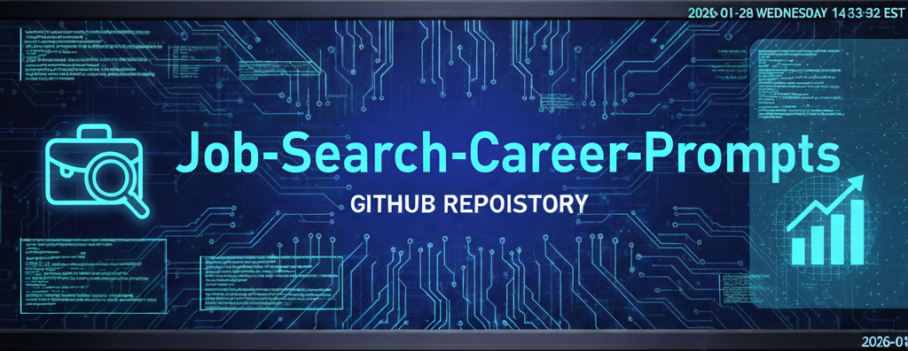
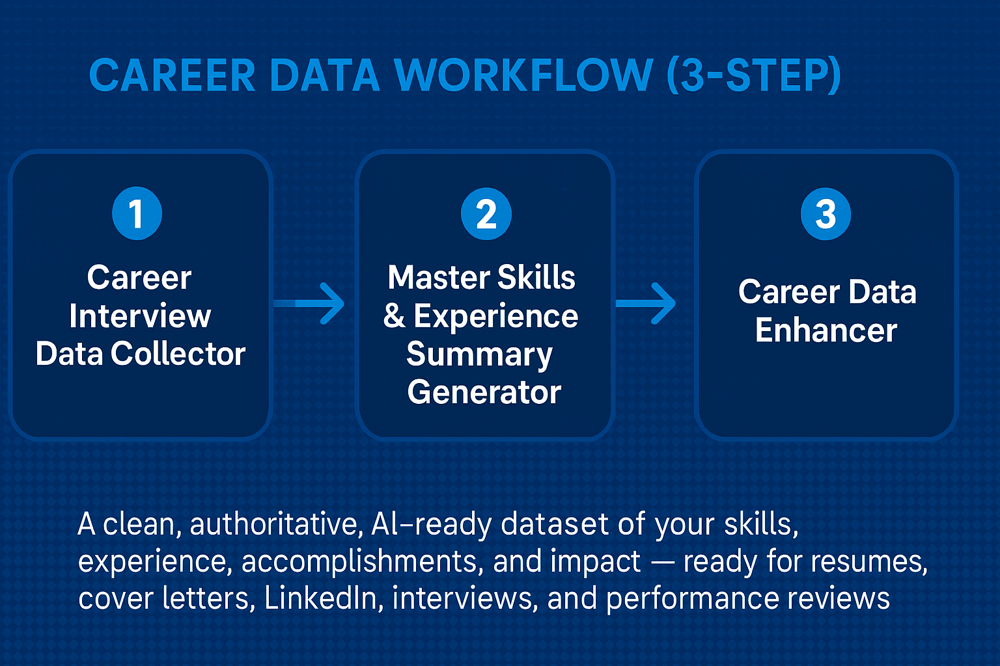

  

<h1 align="center">Job Search & Career Development Prompt Library</h1>
<h3 align="center">By Scott Malin — Cybersecurity & Automation Architect</h3>

A curated collection of AI‑powered prompts designed to accelerate job searches, strengthen professional branding, and support career transitions with clarity and confidence.

  
  
  
  

---

# ⭐ Featured Prompt

### **The Total Resume Architect.md**  
Comprehensive, integrity-first prompt that builds or rebuilds an entire resume from raw career data — structured, ATS-friendly, story-driven, and recruiter-optimized without exaggeration.

---

# 🚀 Career Data Workflow (High‑Value Prompt Sequence)

  

This repository includes a powerful three‑step workflow designed to help job seekers — and working professionals — **capture, structure, and enhance** their career accomplishments with precision.

This workflow solves a major problem:  
**AI hallucinations and inconsistent job‑search materials caused by scattered or incomplete personal data.**

## 1️⃣ Career Interview Data Collector  
Collects structured, high‑signal information about your experience, achievements, responsibilities, and impact.  

## 2️⃣ Master Skills & Experience Summary Generator  
Produces a **clean, authoritative Markdown summary** — your “single source of truth” for all job-search materials.

## 3️⃣ Career Data Enhancer  
Expands, clarifies, strengthens phrasing, surfaces overlooked wins, and tailors content.

### Why This Workflow Matters  
- Governance-grade personal data pipeline  
- Hallucination-resistant consistency  
- Tracks accomplishments year-round  
- Reduces stress during rewrites, reviews, pivots

---

# ⚡ Quick‑Start Guide: How to Use This Repo

1. **Collect Raw Career Data** → Career Interview Data Collector  
2. **Generate Authoritative Summary** → Master Skills & Experience Summary Generator  
3. **Enhance & Expand** → Career Data Enhancer  
4. **Apply Across Materials** → Resumes, cover letters, LinkedIn, interviews, negotiations  
5. **Repeat Anytime** → Job search, performance reviews, promotions, pivots

---

# 📘 Overview

Structured, high-signal prompts to:

- Build strong, authentic application materials  
- Prepare confidently for interviews  
- Analyze postings and companies deeply  
- Strengthen branding on LinkedIn  
- Navigate transitions and negotiations  
- Maintain an authoritative accomplishment record

---

# 📁 Repository Structure & Goals

## 🧭 Career Discovery & Positioning
- **Master Skills & Experience Summary Generator.md** — Core single source of truth  
- **Role-Based Market Skill Expansion Advisor.md** — Identify competitive skill gaps  
- **Career Profile Discovery Engine.md** — Uncover hidden themes & narrative angles  
- **Senior Positioning & Credibility Engine.md** — Articulate executive value  
- **Overqualification Narrative Architect.md** — Reframe overqualification as advantage  

## 📝 Application Materials & Branding
- **The Total Resume Architect.md** *(new highlight)* — Full resume build/rebuild with integrity  
- **Strategic Integrity Resume Engine.md** — High-integrity resume generation  
- **Technical Career Architect.md** — Technical-role resume & story builder  
- **The Human-Centric Resume Auditor & Storyteller.md** — Transform bullets into authentic stories  
- **Resume Customization Prompt – STRATEGIC INTEGRITY.md** — Tailor without fabrication  
- **Resume Redline 4.1 Prompt.md** — Line-by-line critique & redlines  
- **Talent Portal Resume Optimization Engine.md** — ATS/talent portal optimization  
- **Quick Resume Scan Simulation.md** — 7–10 second recruiter/ATS simulation  
- **Proof-of-Work Extractor – 3 Bullet Generator.md** — Condense impact into 3 powerful bullets  
- **JSON → Canonical Markdown Profile Generator.md** — Structured data → clean Markdown  
- **Cover Letter Quality Reviewer – Green Flag Edition.md** — Strengths-focused review  
- **Job-Application Tracker Template.md** — Structured tracking system  

## 🔍 Job Search Tools & Analysis
- **Customizable Job Scanner.md** — Keyword & requirement extraction  
- **Job posting red flag analyzer.md** *(new highlight)* — Surface hidden risks in postings  
- **Job Posting Snapshot & Preservation Engine.md** — Timestamped, offline-safe capture  
- **Job Posting Snapshot - Usage Examples.md** — Real-world usage patterns  
- **Dead Job Posting Recovery Engine.md** — Reconstruct expired postings  
- **Company Technical Intelligence Engine.md** + **Company Technical Intelligence Engine – Query Prompt Guide.md** *(new highlight)* — Deep tech stack, culture & interview intel  
- **CreateNewPostingFile.ps1** — Automate timestamped snapshot files  

## 🎤 Interview Preparation
- **Interview Confidence & Fit Prompt.md** *(new highlight)* — Build confidence & articulate fit  
- **Proactive Interview Mastery Coach.md** — Guided, ongoing interview coaching  
- **INTERVIEW PRESSURE SIMULATOR.md** — High-pressure scenario practice  
- **TECHNICAL INTERVIEW PRESSURE SIMULATOR.md** — Technical stress testing  
- **Behavioral Interview Story Distillation Engine.md** — Refine STAR stories  
- **Interview Intelligence Engine.md** — Company-specific question prediction  
- **Pre-Interview Intelligence Dossier.md** — Targeted research package  
- **Hiring manager response decoder.md** + **Hiring manager response decoder - guide.md** *(new highlight)* — Decode vague or coded feedback/responses  
- **AI Voice Interview Suite** (ChatGPT / Gemini / Grok variants + UsageNotes) — Realistic spoken practice  

## 🧩 Career Data Enhancement
- **Career Data Enhancer.md** — Expand & strengthen your master summary  

## 🔗 LinkedIn Optimization & Branding
- **LinkedIn Profile Analyzer.md**  
- **LinkedIn Profile Imitation Analyzer.md**  
- **LinkedIn Profile Positioning Interview.md**  
- **LinkedIn Summary Crafting Prompt.md**  
- **LinkedIn ↔ Resume Conflict Checker.md**  
- **LinkedIn Connection Request Note Generator.md**  
- **Mentor Recommendation Outreach Generator.md**  

## 🤝 Networking & Contact Management
- **Contacts Collector.md**  
- **Reference Auditor & Formatter.md**  

## 💼 Negotiation & Offer Management
- **Safe Offer Negotiation Assistant.md**  

## 🎯 Quick Branding & Pitch Tools
- **Elevator Pitch Generator.md** — 30–60 second tailored pitches  

## 📄 Repo Files
- **LICENSE**  
- **README.md** (this file)

---

# 🕒 Version History / Changelog

### **v2.0 — March 2026** *(latest)*
- Major prompt additions & highlights: The Total Resume Architect, Company Technical Intelligence Engine, Hiring Manager Response Decoder, Job Posting Red Flag Analyzer, Interview Confidence & Fit Prompt  
- Expanded Interview Preparation, Job Search Tools, and Application Materials sections  
- Added new prompts: Strategic Integrity Resume Engine, Technical Career Architect, Proactive Interview Mastery Coach, First-Pass Impact Optimizer  
- Updated badge dates, featured prompt, and cross-references  

### **v1.9 — March 2026**
- (previous content as in original — expanded structure, added Behavioral/Voice/Intelligence/Dead Job/Overqualification tools, etc.)

(earlier versions omitted — see commit history)

---

# 🔗 Cross‑Repo Navigation

- 🛡️ **Cybersecurity Prompts** → https://github.com/scottmalin68-commits/Cybersecurity-Prompts  
- 🧰 **PowerShell Security & Automation Toolkit** → https://github.com/scottmalin68-commits/Powershell_Scripts  
- 🧩 **Misc AI Prompt Library** → https://github.com/scottmalin68-commits/Misc-AI-Prompts  
- 🎮 **Cybersecurity Learning Prompts** → https://github.com/scottmalin68-commits/Cybersecurity-Learning-Prompts  
- ☁️ **Azure‑Related Prompts** → https://github.com/scottmalin68-commits/Azure-Related-Prompts  
- 🧭 **GitHub Profile** → https://github.com/scottmalin68-commits  

---

# 📜 License  
MIT License — see `LICENSE` for details.