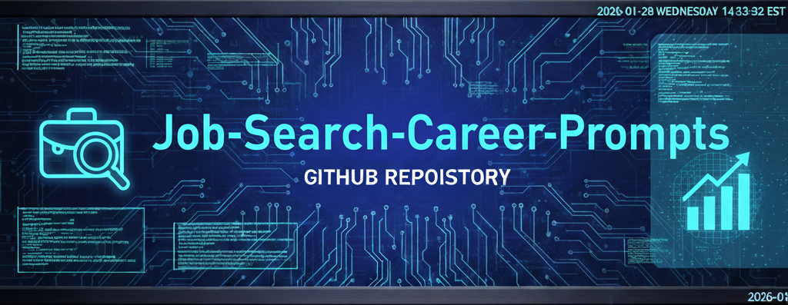
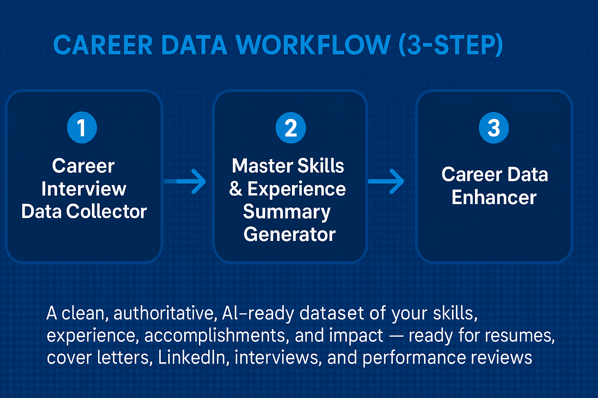

  

<h1 align="center">Job Search & Career Development Prompt Library</h1>
<h3 align="center">By Scott Malin — Cybersecurity & Automation Architect</h3>

A curated, security-minded collection of AI-powered prompts and automation tools that help professionals build accurate, consistent, and high-impact career materials — turning structured thinking into real-world wins.

  
  
  
  

---

### Integrity & Security-First Philosophy

As a cybersecurity architect, I approach career materials the same way I approach systems: **governance-grade accuracy, zero tolerance for fabrication, and proactive risk detection**.

- **No hallucinations or exaggeration** — every prompt enforces a "single source of truth" built from your verified experience.
- **Creative yet disciplined automation** — custom workflows, pressure-tested interview sims, dead-post recovery, and deep intel engines turn scattered data into defensible narratives.
- **Security mindset in action** — red-flag analyzers for postings, response decoders for vague feedback, and integrity checks mirror defensive engineering principles.
- **Outcome focused** — these tools have helped surface real impact, reframe senior value, survive high-pressure interviews, and land roles by staying 100% authentic.

This isn't about gaming recruiters — it's about building a **personal career OS** that scales reliably and reflects true capability.

---

# ⭐ Featured Prompts (September 2026)

### **Job Posting Intelligence Engine – JSON Branch** (v2.1.0)
High-density, evidence-tagged analysis of any job posting. Outputs a strict, machine-readable JSON payload covering fit, tech stack, culture signals, risk surface, compensation intelligence, X-Ray blueprints, and a GO / HOLD / NO_GO verdict. v2.1.0 adds defined `RESOLVED_SILO` / `RESOLVED_ALT_TITLE` logic, a 30% scrape-quality floor, technical-fit NO_GO at ≤29, and a shared Pillar J risk scan.

### **The Final Questions** (v1.2.1)
Generates role-appropriate questions a candidate can ask at the end of an interview. Adapts to recruiter, hiring manager, technical, peer, executive, panel, or unknown. Includes the 3-month decision-confidence and insider-hindsight frameworks, sparse-input protocol, and a spoken-length quality gate. New in September 2026.

### **Competency Signal Fit Engine** (v1.4.3)
Bidirectional, evidence-weighted fit analysis that treats resumes and postings as competency vectors. Produces transparent scoring (S_base / P_gap / B_over / D_conf) plus tactical encounter blueprints. v1.4.3 hardens garbage/jailbreak handling and long-thread output locks.

### **Unified Posting Investigation Engine (JSOM)** (v1.3.1)
Modular OSINT investigation that evaluates legitimacy, hiring intent, culture reality, positioning strategy, and final arbitration in a single structured JSON report.

### **OSINT JSON → Interview Prep Renderer** (v1.3.1)
Fatigue-first converter that turns investigation JSON + candidate profile into a scannable one-page interview brief with deterministic Apply / Light Apply / Skip recommendations.

### **CV Landmines** (v1.1.2) · **Professional Identity Discovery Engine** (v1.1.2) · **Technology Depth Discovery Engine** (v1.1.2)
Adversarial resume QA, evidence-based identity/narrative synthesis, and a proficiency matrix derived from documented experience — not self-ratings.

Latest five-prompt write-up: [Discussions #6](https://github.com/scottmalin68-commits/Job-Search-Career-Prompts/discussions/6)

---

# 🚀 Core Career Data Workflow

  

A repeatable system to capture, govern, and amplify accomplishments — solving the #1 cause of inconsistent AI-assisted job materials: incomplete or untrusted personal data.

1. **Career Interview Data Collector** → Structured capture of responsibilities, wins, metrics, tools, leadership, STAR stories.
2. **Master Skills & Experience Summary Generator** → Authoritative Markdown "single source of truth" — hallucination-resistant foundation for all outputs.
3. **Career Data Enhancer** + **Master_Summary_Maintenance_Engine** → Surface overlooked achievements and keep the source of truth current.

**2026 Expansion**: Directly feeds advanced fit engines, OSINT investigation pipelines, post-interview recall, and full Personal Career OS workflows.

---

# ⚡ Quick-Start Guide: High-ROI Path (September 2026)

1. **Govern** → Master Skills & Experience Summary + Maintenance Engine
2. **Investigate** → Job Posting Intelligence Engine (JSON Branch) or Unified Posting Investigation Engine (JSOM)
3. **Decide & Prepare** → OSINT JSON → Interview Prep Renderer
4. **Fit Deep-Dive** → Competency Signal Fit Engine or Career Profile Gap Analysis Engine
5. **Build Materials** → Strategic Integrity lineage / ATS tools, then CV Landmines before submit
6. **Interview close** → The Final Questions (role-adapted closer set)
7. **Sustain** → Daily Momentum Engine + Rejection Intelligence & Action Advisory Engine

Supporting tools (red-flag analyzer, Job Posting Snapshot & Preservation Engine, OverWatch suite, universal interview architect, etc.) slot in as needed.

---

# 📁 Repository Structure & Goals

## 🧭 Career Discovery & Positioning
- Master Skills & Experience Summary Generator.md
- Career Profile Discovery Engine.md / Career Profile Distiller.md / Career Profile Gap Analysis Engine.md
- Professional Identity Discovery Engine.md / Technology Depth Discovery Engine.md
- Senior Positioning & Credibility Engine.md / Overqualification Narrative Architect.md
- Role-Based Market Skill Expansion Advisor.md / Career Gap Analysis & Skills Enrichment Prompt.md
- Personal Interests & Background.md

## 📝 Application Materials & Branding
- The Total Resume Architect.md
- Strategic Integrity Resume Engine.md / Resume Customization Prompt – STRATEGIC INTEGRITY.md
- Resume Redline 4.1 Prompt.md / Resume Quality Reviewer – Green Flag Edition.md
- ATS Resume Scanner Simulator.md / Talent Portal Resume Optimization Engine.md / Quick Resume Scan Simulation.md
- Proof-of-Work Extractor – 3 Bullet Generator.md / First-Pass Impact Optimizer.md
- ATS Parse-Aware Optimization Layer.md / JSON → Canonical Markdown Profile Generator.md
- Cover Letter Quality Reviewer – Green Flag Edition.md
- CV Landmines.md
- The career landing page engine.md + Operational Guide

## 🔍 Job Search, Intelligence & Risk Analysis
- **Job Posting Intelligence Engine - JSON Branch.md** *(featured — dense JSON intel + X-Ray blueprints + GO/HOLD/NO_GO)*
- **The Unified Posting Investigation Engine - JSOM.md** *(featured — modular OSINT investigation)*
- AI Job Scout & Fit Evaluator.md / Universal Job Fit Evaluation Prompt.md
- Job posting red flag analyser.md
- Job Posting Snapshot & Preservation Engine.md + Usage Examples + Major Platforms + Create-New-Posting-File.ps1
- Dead Job Posting Recovery Engine.md
- Customizable Job Scanner.md / Personal Labor Market Intelligence System.md
- The JD Tech Stack Recon & OSINT Prompt.md
- Target Employer Intelligence Engine.md / Company Technical Intelligence Engine.md

## 🎤 Interview Preparation & Resilience
- **The Final Questions.md** *(featured — role-adapted closer questions)*
- **OSINT JSON - Interview Prep Renderer.md** *(featured — fatigue-first brief from investigation JSON)*
- OSINT JSON - NotebookLM Source Pack Renderer.md
- Interview Confidence & Fit Prompt.md / Proactive Interview Mastery Coach.md
- INTERVIEW PRESSURE SIMULATOR.md / TECHNICAL INTERVIEW PRESSURE SIMULATOR.md
- Behavioral Interview Story Distillation Engine.md / Behavioural Interview Diagnostic.md
- Interview Intelligence Engine.md / Pre-Interview Intelligence Dossier.md / Interviewer Intelligence Engine.md
- Hiring manager response decoder.md + guide.md
- AI Voice Interview Suite (ChatGPT / Gemini / Grok + UsageNotes)
- Recruiter Screening Interview Prep.md / Gatekeeper & Setting the table prompts
- The universal interview architect.md + Usage Guide
- Post-Interview Rapid Recall Engine.md / Post-Interview Thank You Note Generator.md / Post-Interview Signal & Follow-Up Engine.md

## 🧩 Data Governance & Enhancement
- Career Data Enhancer.md
- Career Signal Integrity Engine.md / Master_Summary_Maintenance_Engine.md
- Competency Signal Fit Engine.md

## 🔗 LinkedIn & Networking
- LinkedIn Profile Surgeon.md / Positioning Interview.md / Summary Crafting Prompt.md
- LinkedIn ↔ Resume Conflict Checker.md / LinkedIn Canonical Mirror Engine.md
- LinkedIn Connection Request Note Generator.md / Hiring Manager Outreach Engine.md / Mentor Recommendation Outreach Generator.md
- Contacts Collector.md / Reference Auditor & Formatter.md / LinkedIn Referral & Investigative Engine.md
- LinkedIn Authority Signal Engine.md / LinkedIn Headhunter Tuning prompt.md / LinkedIn Profile Imitation Analyser.md

## 💼 Negotiation, Resilience & Closing
- Safe Offer Negotiation Assistant.md
- Rejection Intelligence & Action Advisory Engine.md
- Daily Momentum Engine.md

## 🛠️ Automation, Orchestration & Market Intelligence
- Career Calibration Engine.md / Opportunity Intelligence & Positioning Engine.md
- Hiring Intent Intelligence Engine.md / Hiring Manager KPI Mapper.md / Hiring Manager Detective.md
- Competency Signal Fit Engine.md / The T-chart alignment engine.md
- **OverWatch suite** (Nexus Blueprint Engine, Hunt Protocol Execution Engine.ps1, Action Report Engine, Dork Optimization, Merge Reports)
- Invoke-JobSearchQueries.ps1 and other PowerShell helpers

## 🎯 Quick Wins
- Elevator Pitch Generator.md
- Career Transition Announcement Builder.md

---

# 🕒 Version History / Changelog

### **v5.0 — September 2026** (current)
- Job Posting Intelligence Engine (JSON Branch) advanced to **v2.1.0**: `RESOLVED_SILO` / `RESOLVED_ALT_TITLE`, scrape-failure floor, technical-fit NO_GO, shared Pillar J risk scan.
- Added **The Final Questions** (v1.2.1) for role-adapted interview closers.
- Competency Signal Fit Engine to **v1.4.3**. CV Landmines, PIDE, and TDDE to **v1.1.2**.
- Repo-wide hardening: garbage/jailbreak rejection, state-lock templates, markdown fallbacks.
- Job tracker integrity rules, OverWatch search-string constraints, Create-New-Posting-File.ps1 v2.0.5.
- Discussions opened; latest five-prompt announcement in [#6](https://github.com/scottmalin68-commits/Job-Search-Career-Prompts/discussions/6).
- Last Updated: 2026-09-23

### **v4.0 — August 2026**
- Major intelligence layer expansion: Job Posting Intelligence Engine (JSON Branch) reached v1.0.5 with data-quality Step 0 warnings, X-Ray blueprint generation (PILLAR G), and schema hardening.
- Unified Posting Investigation Engine (JSOM) v1.3.1 and OSINT JSON → Interview Prep Renderer v1.3.1.
- Added Career Profile Gap Analysis Engine.
- Last Updated: 2026-08-21

### **v3.0 — June 2026**
- Expansion into full Personal Career OS: Rejection Intelligence, Daily Momentum, Post-Interview Rapid Recall, Career Landing Page Engine, Competency Signal Fit Engine, Hiring Intent tools, ATS Parse-Aware Optimization Layer.

### **v2.0 — March 2026**
- Added Integrity & Security-First Philosophy section and promoted Core Toolkit usage.

(earlier versions in commit history)

---

# 🔗 Cross-Repo Navigation
- 🛡️ Cybersecurity Prompts → https://github.com/scottmalin68-commits/Cybersecurity-Prompts
- 🎮 Cybersecurity Learning Prompts → https://github.com/scottmalin68-commits/Cybersecurity-Learning-Prompts
- 🧩 Misc AI Prompts → https://github.com/scottmalin68-commits/Misc-AI-Prompts
- 🧰 PowerShell Security & Automation → https://github.com/scottmalin68-commits/Powershell_Scripts
- 🧭 GitHub Profile → https://github.com/scottmalin68-commits

---

# 📜 License
MIT License — see `LICENSE` for details.
